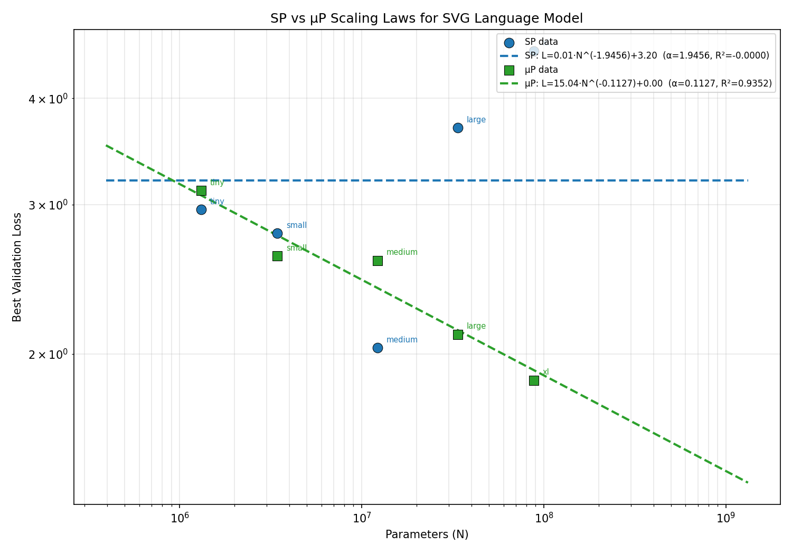
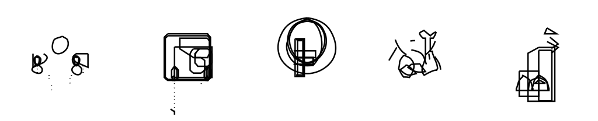

# Scaling Laws for Language Models on SVG Code

An empirical study of neural scaling laws applied to SVG (Scalable Vector Graphics) code generation using decoder-only Transformers. This project trains GPT-style language models of varying sizes on SVG data and fits power-law scaling curves to characterize how validation loss decreases with model size.

The project also compares **Standard Parameterization (SP)** with **Maximal Update Parameterization (muP)** to evaluate learning rate transferability across model scales.

**[Project Page](https://katsukii.github.io/svg-scaling-project/)** | **[Full Report (PDF)](https://katsukii.github.io/svg-scaling-project/report.pdf)**

### Key Results



**Scaling curves under SP and muP.** SP's Tiny-optimal learning rate causes Large/XL models to diverge. muP enables zero-shot LR transfer, and losses follow a power-law trend (L = 0.85 N^-0.043, R^2 = 0.76).



**Generated SVG samples** from the muP XL model (88.1M parameters). The model learns to produce valid, renderable SVG icons from a 107M-token corpus.

## Setup

### Requirements

- Python 3.10+
- PyTorch 2.0+
- CUDA GPU recommended for training (tested on A100 40GB via Google Colab)

### Installation

```bash
git clone https://github.com/katsukii/svg-scaling-project.git
cd svg-scaling-project
pip install -r requirements.txt
```

## Data Preparation

### 1. Preprocessing

Download and clean SVG data from HuggingFace (`starvector/svg-icons-simple`):

```bash
# Download from HuggingFace and preprocess in one step
python src/preprocess.py \
    --download starvector/svg-icons-simple \
    --output-dir data/processed \
    --min-len 50

# Or, if data is already saved locally (--download saves to
# data/raw/starvector_svg-icons-simple by default)
python src/preprocess.py \
    --input-dir data/raw/starvector_svg-icons-simple \
    --output-dir data/processed \
    --min-len 50
```

If the dataset has only a `train` split, the script automatically creates 98%/1%/1% train/val/test splits by file to avoid data leakage.

This pipeline:
- Strips HTML/XML comments
- Removes metadata elements (`<metadata>`, `<title>`, `<desc>`)
- Normalizes coordinate precision to 1 decimal place
- Compresses unnecessary whitespace
- Validates well-formed XML
- Validates rendering via CairoSVG
- Filters out SVGs shorter than 50 characters

### 2. Tokenization

Train a BPE tokenizer and convert to binary format:

```bash
python src/tokenize_data.py \
    --input-dir data/processed \
    --output-dir data/tokenized \
    --vocab-size 4096 \
    --max-token-len 0
```

With `--max-token-len 0` (no filter), all sequences are kept regardless of length. The training loop's `block_size` (1024) handles sequence windowing. Set a positive value (e.g., 2048) to filter long sequences if needed.

## Training

### Model Configurations

Five model sizes are provided in `configs/`:

| Config | Params | Layers | Heads | d_model | d_ff  |
|--------|--------|--------|-------|---------|-------|
| tiny   | ~1.3M  | 4      | 4     | 128     | 512   |
| small  | ~3.4M  | 6      | 6     | 192     | 768   |
| medium | ~12.2M | 6      | 6     | 384     | 1536  |
| large  | ~33.6M | 10     | 8     | 512     | 2048  |
| xl     | ~88.1M | 12     | 12    | 768     | 3072  |

All models use the same effective token batch size (16,384 tokens/step). The XL config uses gradient accumulation (`grad_accum_steps: 2`) to match this while fitting in GPU memory.

### Standard Parameterization (SP)

```bash
python src/train.py --config configs/tiny.yaml
python src/train.py --config configs/xl.yaml
```

Results are saved to `results/runs/{config_name}_{timestamp}/`. To specify a custom output directory:

```bash
python src/train.py --config configs/tiny.yaml --output-dir results/runs/sp/tiny
```

### muP (Maximal Update Parameterization)

Uses the [mup](https://github.com/microsoft/mup) package for width-independent hyperparameter transfer:

```bash
python src/train.py --config configs/tiny.yaml --mup
python src/train.py --config configs/xl.yaml --mup
```

### Resume Training

Resume from a checkpoint (required for Part 4 additional epoch training):

```bash
python src/train.py --config configs/xl.yaml --mup \
    --resume results/runs/mup_xl_extended/final_checkpoint.pt \
    --max-steps 12000
```

## Generation

Generate SVG samples from a trained checkpoint:

```bash
# Unconditional generation
python src/generate.py \
    --config configs/xl.yaml \
    --checkpoint results/runs/mup_xl_extended/best_model.pt \
    --mup \
    --num-samples 10 \
    --temperature 0.8 \
    --top-k 50 \
    --top-p 0.95 \
    --output-dir results/samples/

# Prefix-conditioned generation
python src/generate.py \
    --config configs/xl.yaml \
    --checkpoint results/runs/mup_xl_extended/best_model.pt \
    --mup \
    --prefix '<svg viewBox="0 0 24 24"><circle cx="12" cy="12" r="10"' \
    --temperature 0.8 \
    --output-dir results/samples/prefix/
```

Complete SVGs are saved as `sample_N.svg`; incomplete outputs (missing `</svg>`) are saved as `sample_N_incomplete.txt`.

## Evaluation

Run quantitative evaluation on generated samples. Both `.svg` and `_incomplete.txt` files count toward the denominator:

```bash
python src/evaluate.py \
    --config configs/xl.yaml \
    --checkpoint results/runs/mup_xl_extended/best_model.pt \
    --mup \
    --samples-dir results/samples/ \
    --test-data data/tokenized/test.bin
```

Metrics: test perplexity, completion rate, XML validity rate, SVG render rate, structural validity (including attribute value checks).

## Analysis Scripts

```bash
# SP vs muP scaling law comparison + power law fit + extrapolation
python scripts/analyze_mup.py

# SP-only scaling analysis
python scripts/analyze_scaling.py

# LR sweep result analysis (summary table + plots)
python scripts/analyze_lr_sweep.py

# muP coordinate check (activation norm stability across widths)
python scripts/coord_check.py

# Training loss curves for all model sizes
python scripts/plot_training_curves.py --run-dir results/runs/mup

# Token sequence length histogram
python scripts/plot_token_histogram.py

# Prefix completion comparison grid across model sizes
python scripts/plot_prefix_comparison.py

# Dataset example renders (simple/medium/complex grid)
python scripts/render_examples.py

# Generate unconditional + prefix samples from each model size (Tiny→XL)
python scripts/generate_size_comparison.py
```

## Repository Structure

```
svg-scaling-project/
├── configs/              # Model size configurations (tiny through xl)
├── docs/                 # Project specification and GitHub Pages site
│   ├── assets/           # Images for project page
│   ├── index.html        # GitHub Pages project page
│   └── report.pdf        # Final report PDF (served via Pages)
├── results/
│   ├── evaluation_v2/    # Extended evaluation (metrics, grids)
│   ├── plots/            # Generated analysis plots
│   ├── prefixes_v2/      # Prefix SVG templates for conditioned generation
│   ├── samples_v2/       # Samples across temperature/sampling settings
│   └── samples_size_comparison/ # Cross-size generation comparison
├── scripts/              # Analysis, visualization, and experiment scripts
│   ├── analyze_lr_sweep.py       # LR sweep result analysis
│   ├── analyze_mup.py            # SP vs muP scaling comparison
│   ├── analyze_scaling.py        # SP scaling law analysis
│   ├── coord_check.py            # muP coordinate check
│   ├── generate_size_comparison.py # Cross-size sample generation
│   ├── plot_prefix_comparison.py # Prefix-conditioned comparison plots
│   ├── plot_token_histogram.py   # Token sequence length histogram
│   ├── plot_training_curves.py   # Training curve visualization
│   ├── render_examples.py        # Dataset example renders
│   ├── run_lr_sweep.sh           # SP LR sweep runner
│   ├── run_mup_lr_sweep.sh       # muP LR sweep runner
│   ├── run_mup_scaling_study.sh  # muP scaling study runner
│   ├── run_scaling_study.sh      # SP scaling study runner
│   ├── colab_eval_v2.ipynb       # Extended evaluation notebook
│   ├── colab_full_pipeline.ipynb # Full training pipeline notebook
│   └── colab_size_comparison.ipynb # Cross-size comparison notebook
├── src/
│   ├── preprocess.py     # SVG cleaning and filtering pipeline
│   ├── tokenize_data.py  # BPE tokenization
│   ├── model.py          # GPT model (SP and muP modes)
│   ├── train.py          # Training loop with sequential epoch iteration
│   ├── generate.py       # SVG generation with top-k/top-p sampling
│   ├── evaluate.py       # Quantitative evaluation
│   └── plot_training_curves.py  # Training curve plot utility
├── tokenizer/            # Trained BPE tokenizer files
├── requirements.txt
└── README.md
```

## Attribution

The model architecture and training loop are adapted from [nanoGPT](https://github.com/karpathy/nanoGPT) by Andrej Karpathy. Key modifications and original implementations:

**Borrowed from nanoGPT** (with modifications):
- GPT class structure (CausalSelfAttention, MLP, Block)
- Cosine learning rate schedule with warmup

**Modified or implemented from scratch:**
- Sequential epoch iterator (shuffled non-overlapping windows, without replacement)
- muP integration via the `mup` package (MuReadout, MuAdamW, base shape setup)
- SVG-specific preprocessing pipeline (coordinate normalization, render validation)
- BPE tokenizer training on SVG data
- Gradient accumulation for uniform token batch sizes
- Top-p (nucleus) sampling
- Evaluation pipeline (XML validity, render rate, structural/attribute checks)
- All analysis and visualization scripts
- Power law fitting with confidence intervals

## References

- Kaplan et al. (2020). "Scaling Laws for Neural Language Models"
- Hoffmann et al. (2022). "Training Compute-Optimal Large Language Models" (Chinchilla)
- Yang et al. (2022). "Tensor Programs V: Tuning Large Neural Networks via Zero-Shot Hyperparameter Transfer" (muP)
